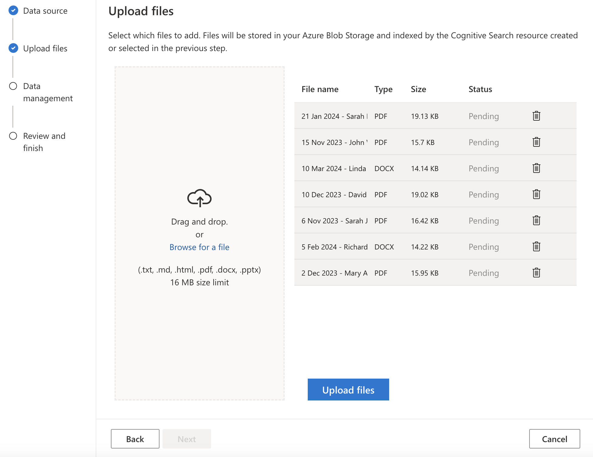

# EcoGroceries Call Center message extension with Cognitive Search sample


This sample implements Cognitive Search with a Teams message extension that enables Hybrid Search (Vector + Semantic) and can be used as a plugin for Microsoft Copilot for Microsoft 365. Architecture below demonstrates how developers can use Copilot for Microsoft 365 in **Bring Your Own Data** scenarios instead of building a custom GPT powered bot.


The message extension allows users to query data inside the [EcoGroceries Call Center records](./documents) and returns the most accurate results with the power of Hybrid Search (Vector + Semantic).


## Prerequisites

- [Node.js 18.x](https://nodejs.org/download/release/v18.18.2/)
- [Visual Studio Code](https://code.visualstudio.com/)
- [Teams Toolkit](https://marketplace.visualstudio.com/items?itemName=TeamsDevApp.ms-teams-vscode-extension)
- [Azure subscription](https://portal.azure.com)
- You will need a Microsoft work or school account with [permissions to upload custom Teams applications](https://learn.microsoft.com/microsoftteams/platform/concepts/build-and-test/prepare-your-o365-tenant#enable-custom-teams-apps-and-turn-on-custom-app-uploading). The account will also need a Microsoft Copilot for Microsoft 365 license to use the extension in Copilot.
- You will need to create [Cognitive Search](https://learn.microsoft.com/en-us/azure/search/search-create-service-portal), [Blob Storage](https://learn.microsoft.com/en-us/azure/storage/blobs/storage-quickstart-blobs-portal) and [Azure OpenAI](https://learn.microsoft.com/en-us/azure/ai-services/openai/how-to/create-resource?pivots=web-portal) resources on Azure portal.

## Setup and use the sample

This sample requires a manual step to upload documents to Cognitive Search in embeddings format before running the app locally and testing the Hybrid Search (Vector + Semantic) capability with Copilot for Microsoft 365.

### Step 1 - Upload documents to Cognitive Search

In this step, you will use Azure OpenAI Studio, **Add Your Data** capability to upload documents to Cognitive Search in embeddings format.
   1. Open the **Azure OpenAI** resource you created earlier, select **Go to Azure OpenAI Studio**.
   1. In Azure OpenAI Studio, select **Deployments**, create  two new deployment models, select `gpt-35-turbo-16k` as a model type in the first model and `text-embedding-ada-002` for the second model.
   1. Select **Chat** from the menu and select **Add your data(preview)** under the **Assistant setup** section, then **Add a data source**.
   1. Select **Upload files** from the drop-down menu:
      - Select your `subscription`.
      - Select the `Blob Storage` and `Cognitive Search` resources you created in the pre-requisites.
      - Provide an index name.
      - Check the box for `Add vector search to this search resource.`
      - Select the `text-embedding-ada-002` model you created earlier.
      - Check the box for the acknowledgement, then select **Next**.
      
      - Drag and drop the files from the [documents](./documents) folder to the **Upload files** section, then select **Upload files**.
      .

Once the documents are successfully uploaded to Cognitive Search index as embeddings, you can test your data in the Chat section by using the following questions:
   - "Any customer complaints recently?"
   - "Find refund orders"

### Step 2 - Run the application locally

[Clone](https://github.com/OfficeDev/Copilot-for-M365-Plugins-Samples.git) or [Download](https://github.com/OfficeDev/Copilot-for-M365-Plugins-Samples.git) the sample repository:  [https://github.com/OfficeDev/Copilot-for-M365-Plugins-Samples/](https://github.com/OfficeDev/Copilot-for-M365-Plugins-Samples/).

Navigate to the **samples/msgext-doc-search-js** folder and open with Visual Studio Code.

Navigate to the **samples/msgext-doc-search-js/env** folder, rename `.env.local.sample` file to `.env.local.sample` and `.env.local.user.sample` file to `.env.local.user`. In `.env.local.user` file, provide the following variables: 
   ```txt
      AZURE_OPENAI_SERVICE_NAME= the name of the Azure OpenAI resource 
      AZURE_OPENAI_DEPLOYMENT_NAME= the deployment name of the `text-embedding-ada-002` model
      AZURE_OPENAI_API_KEY= the key available under Keys and endpoints on Azure OpenAI resource
      AZURE_SEARCH_ENDPOINT= the endpoint url of Azure Cognitive Search
      AZURE_SEARCH_ADMIN_KEY= the admin key available under Keys on Azure Cognitive Search resource
      AZURE_SEARCH_INDEX_NAME= the index name created when uploading documents
   ```
Click F5 to start debugging, or click the start button 1️⃣. You will have an opportunity to select a debugging profile; select Debug in Teams (Edge) 2️⃣ or choose another profile.


It may take a while the first time as it's loading all the npm packages. Eventually, a browser window will open and invite you to log in.


Once you're in, Microsoft Teams should open up and display a dialog offering to install your application.

Select **Add** to add EcoGroceries Call Center as a personal application.

> **Note:** Test the message extension on Teams chat first before testing it on Copilot for Microsoft 365.

### Step 3 - Test the app in Copilot for Microsoft 365
Navigate to the Microsoft Copilot for Microsoft 365 chat. Check the lower left of the chat user interface, below the compose box. You should see a plugin icon 1️⃣ . Click this and enable the Northwind Inventory plugin 2️⃣ .


For best results, start a new chat by typing "New chat" before each prompt or set of related prompts.

Here are some prompts to try that use only a single parameter of the message extension:

* "Find refund orders in EcoGroceries"

* "Any customer complaints in EcoGroceries?"

* "Find any info about the order no 345678 in EcoGroceries"

* "How was the call between customer agent and Sarah Ramirez in EcoGroceries?"

As you're testing, watch the log messages within your application. You should be able to see when Copilot calls your plugin.
