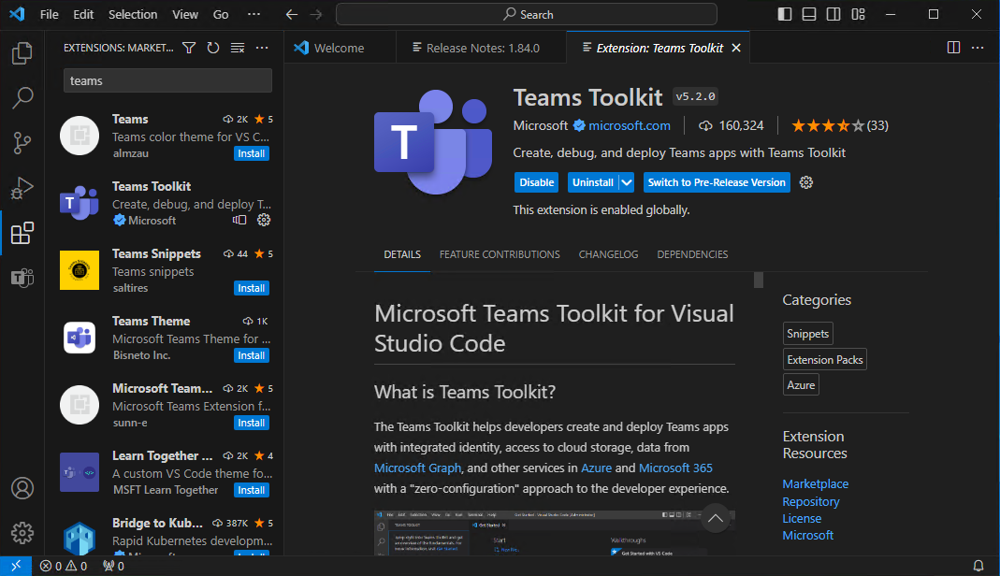
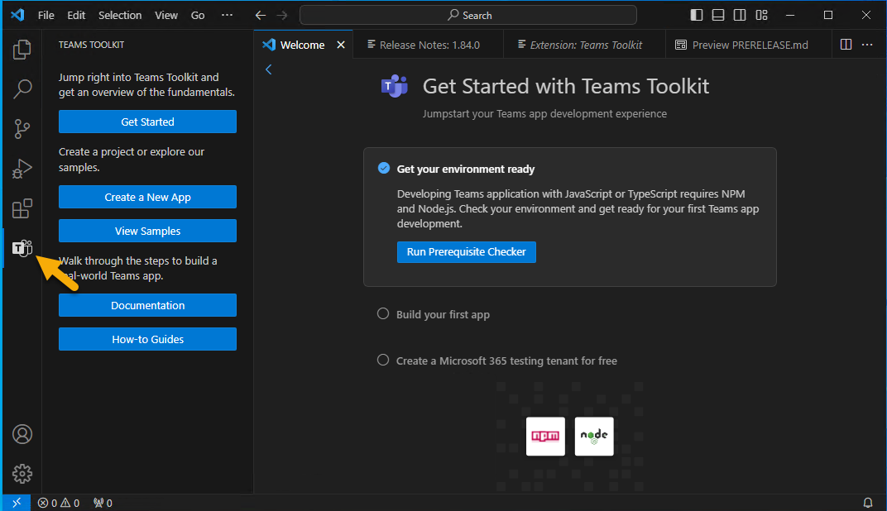
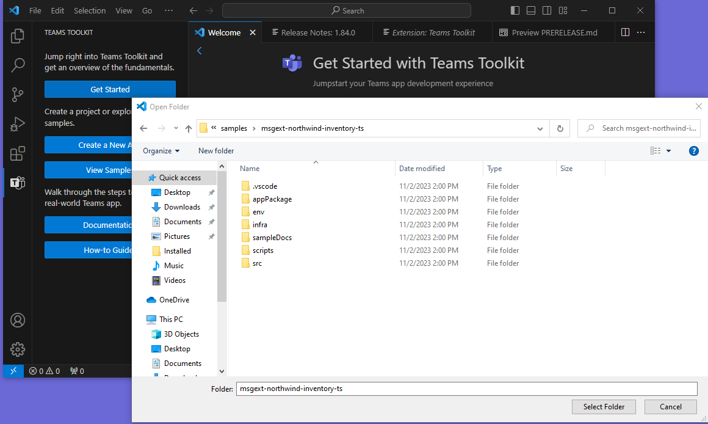

# Exercise 1 - Set up your development environment

## Step 1 - Install prerequisites

> NOTE: If you are attending an Ignite lab, these prerequisites have already been installed on your workstation; please skip to Step 2.

Please install the following on your computer:

1. Visual Studio Code (latest version)
2. NodeJS version 18.x - You may want to first install Node Version Manager or Node Version Manager for Windows so you can change NodeJS versions in the future; if you do, use these commands to install NodeJS version 18.x

~~~sh
nvm install 18.18
nvm use 18.18
~~~

3. Azure Storage Explorer (OPTIONAL) - Download this if you want direct access to the Northwind database used in this sample

## Step 2 - Download the sample code

If you know your way around Github, then clone, or fork and clone, the sample repository at [https://github.com/OfficeDev/Copilot-for-M365-Plugins-Samples/](https://github.com/OfficeDev/Copilot-for-M365-Plugins-Samples/).

If you don't want to deal with Github, you can download a zip file [here](https://github.com/OfficeDev/Copilot-for-M365-Plugins-Samples/archive/refs/heads/main.zip). Unzip the files to a location on your computer.

However you downloaded the repository, navigate to the **samples/msgext-northwind-inventory-ts** folder inside. These labs will refer to this as your "working folder" since this is where you'll be working.

## Step 3 - Copy sample documents to your test user's OneDrive

## Step 4 was 3 - Install and set up Teams Toolkit for Visual Studio Code

