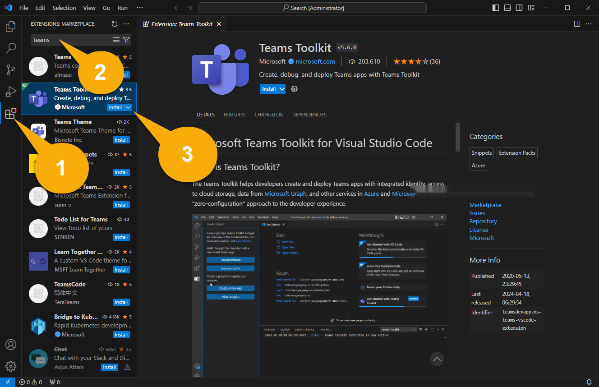
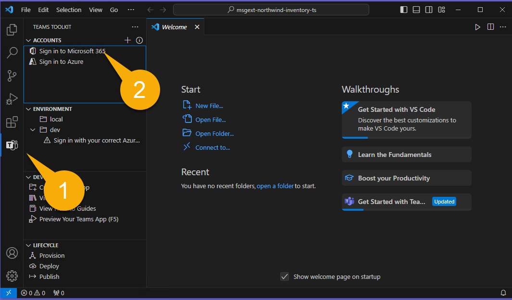

# Building Message Extensions for Microsoft Copilot for Microsoft 365

TABLE OF CONTENTS

* [Welcome](./Exercise%2000%20-%20Welcome.md)
* [Exercise 1](./Exercise%2001%20-%20Set%20up.md) - Set up your development Environment  (THIS PAGE)
* [Exercise 2](./Exercise%2002%20-%20Run%20sample%20app.md) - Run the sample Message Extension
* [Exercise 3](./Exercise%2003%20-%20Run%20in%20Copilot.md) - Run the sample as a Copilot plugin
* [Exercise 4](./Exercise%2004%20-%20Code%20tour.md) - Code tour

# Exercise 1 - Set up your development environment

## Step 1 - Install prerequisites

> NOTE: If you are attending an Ignite lab, these prerequisites have already been installed on your workstation; please skip to Step 2.

Please install the following on your computer:

1. [Visual Studio Code](https://code.visualstudio.com/) (latest version)

2. [NodeJS version 18.x](https://nodejs.org/download/release/v18.18.2/) - You may want to first install [Node Version Manager](https://github.com/nvm-sh/nvm) or [Node Version Manager for Windows](https://github.com/coreybutler/nvm-windows) so you can change NodeJS versions in the future; if you do, use these commands to install NodeJS version 18.x

~~~sh
nvm install 18.18
nvm use 18.18
~~~

3. [Azure Storage Explorer](https://azure.microsoft.com/products/storage/storage-explorer/) (OPTIONAL) - Download this if you want to view and edit the Northwind database used in this sample

## Step 2 - Download the sample code

If you know your way around Github, then clone, or fork and clone, the sample repository at [https://github.com/OfficeDev/Copilot-for-M365-Plugins-Samples/](https://github.com/OfficeDev/Copilot-for-M365-Plugins-Samples/).

If you don't want to deal with Github, you can download a zip file [here](https://github.com/OfficeDev/Copilot-for-M365-Plugins-Samples/archive/refs/heads/main.zip). Unzip the files to a location on your computer.

Within the cloned or downloaded repository, navigate to the **samples/msgext-northwind-inventory-ts** folder. These labs will refer to this as your "working folder" since this is where you'll be working.

## Step 3 - Copy sample documents to your test user's OneDrive

The sample application includes some documents for Copilot to reference during the labs. You will find a filder, **sampleDocs**. in your working folder. Copy these documents to the OneDrive for whatever user you'll be logged in as when testing Microsoft Copilot for Microsoft 365. If you're sharing a Microsoft 365 tenant with other users, ensure that only you can access the documents so they won't see duplicates when they do the labs.

By doing this step early, there's a good chance that the Microsoft 365 search engine will have discovered them by the time you're ready for them!

If you're using a new tenant, such as in an in-person lab, it would be a good idea to log into the [Microsoft 365 application](https://office.com) at this point and to open Microsoft Teams in browser. Depending on how the tenant is set up, you may be asked to set up multi-factor authentication as part of this process.

## Step 4 - Install and set up Teams Toolkit for Visual Studio Code

In this step, you'll install the latest version of [Teams Toolkit for Visual Studio Code](https://learn.microsoft.com/microsoftteams/platform/toolkit/teams-toolkit-fundamentals?pivots=visual-studio-code-v5). The easiest way to do this is from right inside of Visual Studio Code.

Open your working folder in Visual Studio Code. You may be asked to trust the authors of this folder; if so, please do.

In the left sidebar, select the Extensions icon1️⃣. Enter the word "teams" into the search box 2️⃣ and locate "Teams Toolkit" in the search results. Click "Install" 3️⃣.

Now select the Teams Toolkit icon in the left 1️⃣ . If it offers options to create a new project, you're probably in the wrong folder. Instead you should see sections for Accounts, Environment, etc. as shown below.

Under "Accounts" click "Sign in to Microsoft 365"2️⃣ and log in with the Microsoft 365 account provided by the lab instructors, or with your own Microsoft 365 developer account. You can get a free Microsoft 365 subscription for development purposes by joining the [Microsoft 365 Developer Program](https://developer.microsoft.com/microsoft-365/dev-program).

A browser window will pop up and offer to log into Microsoft 365. When it says "You are signed in now and close this page", please do so.

Now verify that the "Sideloading enabled" checker has a green checkmark. If it doesn't, that means that your user account doesn't have permission to upload Teams applications. This permission is "off" by default; here are [instructions for enabling users to upload custom apps](https://learn.microsoft.com/microsoftteams/teams-custom-app-policies-and-settings#allow-users-to-upload-custom-apps)

## Congratulations

You have completed Exercise 1.
Please proceed to [Exercise 2](./Exercise%2002%20-%20Run%20sample%20app.md) in which you will run the sample application.